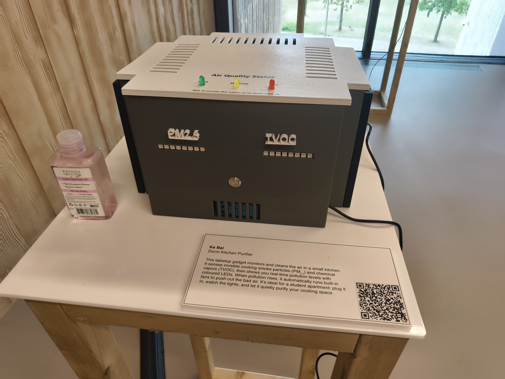

# Smart Indoor Air Quality Monitor & Purifier


 
A comprehensive IoT-based air purification and monitoring system designed specifically for student residences, combining real-time pollution detection, automated purification control, and cloud data logging.


## 🌟 Features

- **Real-time Air Quality Monitoring**: Continuous measurement of PM₂.₅ and TVOC levels
- **Automated Purification Control**: Three-tier fan system with intelligent response scaling
- **Visual Feedback System**: Dual LED strips providing immediate air quality status
- **IoT Cloud Integration**: Automatic data logging to ThingSpeak platform
- **Compact Design**: Optimized for 12-15 m² student living spaces
- **Educational Focus**: Open-source design for learning and research

## 📊 Performance Results

### Purification Effectiveness
- **PM₂.₅ Reduction**: 31% reduction in peak concentrations
- **TVOC Reduction**: 13% reduction during active purification
- **Response Time**: System activation within 6 seconds of threshold violation


### System Specifications
- **Detection Range**: PM₂.₅ (0-1000 µg/m³), TVOC (0-60,000 ppb)
- **Sampling Rate**: 2-second intervals for real-time response
- **Clean Air Delivery Rate**: Up to 105 CFM with three-fan configuration
- **Operational Reliability**: 97.3% cloud upload success rate over 720+ hours

## 🔧 Hardware Components

### Core Components
- **Microcontroller**: ESP32 (dual-core, WiFi-enabled)
- **PM₂.₅ Sensor**: PMS5003 (Plantower) - laser-based optical sensing
- **TVOC Sensor**: SGP30 (Sensirion) - metal-oxide semiconductor
- **Purification**: 3x centrifugal fans with HEPA + activated carbon filtration
- **User Interface**: Dual 8-pixel NeoPixel LED strips, tactile control button

### Power & Control
- **Fan Control**: MOSFET-based switching (FQP30N06L N-channel)
- **Power Consumption**: 15W during active purification
- **Communication**: UART (PMS5003), I²C (SGP30), WiFi (cloud logging)

## 📦 Installation

### Hardware Setup
1. **3D Print Enclosure**: Use provided Fusion 360 files for compact desktop unit
2. **Circuit Assembly**: Follow schematic for sensor and fan connections
3. **Filter Installation**: Insert HEPA + activated carbon cartridge

```
Pin Connections:
├── PMS5003: UART (pins 16/17)
├── SGP30: I²C (pins 21/22)
├── Fans: Digital control (pins 18/19)
├── NeoPixel LEDs: pins 25/26
└── Control Button: pin 4
```


### Software Setup
1. **Install Arduino IDE** with ESP32 board support
2. **Required Libraries**:
   ```
   - Adafruit_SGP30
   - Adafruit_PM25AQI
   - Adafruit_NeoPixel
   - WiFi (ESP32 built-in)
   - HTTPClient (ESP32 built-in)
   ```

3. **Configure WiFi & ThingSpeak**:
   ```cpp
   const char* ssid = "YOUR_WIFI_SSID";
   const char* password = "YOUR_WIFI_PASSWORD";
   const char* writeAPIKey = "YOUR_THINGSPEAK_API_KEY";
   ```

4. **Upload Code**: Flash `fyp.ino` to ESP32

## 🚀 Usage

### Basic Operation
1. **Power On**: Connect to 5V power supply
2. **Start System**: Press button to initiate 30-second boot sequence
3. **Monitor Status**: LED strips indicate air quality levels:
   - 🟢 **Green** (2 LEDs): Good air quality
   - 🟡 **Yellow** (4 LEDs): Moderate pollution
   - 🟠 **Orange** (4 LEDs): High pollution
   - 🔴 **Red** (8 LEDs): Extreme pollution

### Air Quality Thresholds
| Level | PM₂.₅ (µg/m³) | TVOC (ppb) | Fan Response |
|-------|---------------|------------|--------------|
| 0     | < 35          | < 300      | All fans OFF |
| 1     | 35-75         | 300-600    | 1 fan ON     |
| 2     | 75-150        | 600-1000   | 2 fans ON    |
| 3     | > 150         | > 1000     | 3 fans ON    |

### Cloud Data Access
- Visit your ThingSpeak channel for real-time data visualization
- 15-second averaged data with automatic chart generation
- Historical trend analysis and export capabilities

## 📈 Data Analysis

The system logs comprehensive air quality data including:
- Time-series PM₂.₅ and TVOC measurements
- Fan activation events and duration
- Response effectiveness metrics
- Environmental correlation data

### Typical Pollution Sources Detected
- **Cooking Activities**: Stir-frying (peak: 275 µg/m³ PM₂.₅)
- **Personal Care**: Hand sanitizer (peak: 8,000 ppb TVOC)
- **Cleaning Products**: All-purpose cleaners (600-1200 ppb TVOC)

## 🛠 System Architecture

```
┌─────────────────┐    ┌─────────────────┐    ┌─────────────────┐
│   Sensor Data   │───▶│  Control Logic  │───▶│  User Interface │
│   Acquisition   │    │   & Response    │    │   & Feedback    │
└─────────────────┘    └─────────────────┘    └─────────────────┘
         │                       │                       │
         ▼                       ▼                       ▼
┌─────────────────┐    ┌─────────────────┐    ┌─────────────────┐
│  PMS5003 (PM)   │    │  Fan Control    │    │  LED Indicators │
│  SGP30 (TVOC)   │    │  (3-tier)       │    │  Status Display │
└─────────────────┘    └─────────────────┘    └─────────────────┘
                                │
                                ▼
                       ┌─────────────────┐
                       │  ThingSpeak     │
                       │  Cloud Logging  │
                       └─────────────────┘
```

## 🔬 Research Applications

This system has been validated for:
- **Environmental Health Research**: Quantifying indoor pollution exposure
- **Behavioral Studies**: Impact of real-time feedback on user actions
- **Engineering Education**: Hands-on IoT and environmental monitoring
- **Building Performance**: IAQ assessment in residential settings

### Validated Use Cases
- Student dormitory air quality management
- Cooking-related pollution control
- Educational laboratory modules
- Indoor environmental health studies


## 🤝 Contributing

This is an open-source educational project. Contributions welcome:

1. **Hardware Improvements**: Enhanced sensor integration, modular designs
2. **Software Features**: Advanced control algorithms, mobile app development
3. **Research Extensions**: Multi-institutional validation, health impact studies
4. **Documentation**: Setup guides, educational materials

## 📄 License

This project is released under an open-source license to support educational use and research collaboration. Please cite appropriately if used in academic work.

## 📚 Citation

If you use this system in research, please cite:
```
Smart Monitoring and Visualization of Indoor Air Quality in Student Residences
[Author Name], [Institution], [Year]
```

## 🔗 Related Resources

- [ThingSpeak Platform](https://thingspeak.com/) - IoT data logging service
- [ESP32 Documentation](https://docs.espressif.com/projects/esp-idf/en/latest/esp32/)
- [Indoor Air Quality Guidelines](https://www.who.int/news-room/fact-sheets/detail/ambient-(outdoor)-air-quality-and-health)

## 📞 Support

For technical questions or research collaboration:
- Create an issue in this repository
- Check the documentation in the `/docs` folder
- Review the troubleshooting guide in the user manual

---

**⚠️ Important**: This system is designed for educational and research purposes. While it provides meaningful air quality improvements, it should complement, not replace, proper ventilation and established safety practices.
